# Compositor for Windows

一个跑在 Windows 上的开源图层式图像编辑器，用 Python + PySide6 写成。

它的目标是替代 Photoshop 做**合成与后期**的核心工作流：图层、蒙版、混合模式、
非破坏性变换、调整层、滤镜、选区、画笔、文字与 PSD 导入。
受 [robbietilton/Compositor](https://github.com/robbietilton/Compositor)
启发——那个项目是 macOS 独占的（Swift / Xcode / macOS 26 + Apple silicon），
这里是给 Windows 的对应实现，**不是**它的移植版，功能范围也小得多。


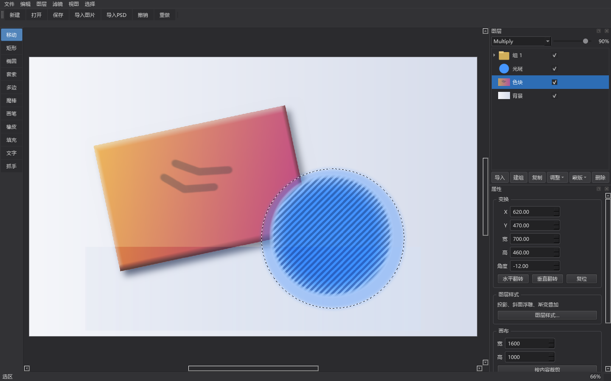

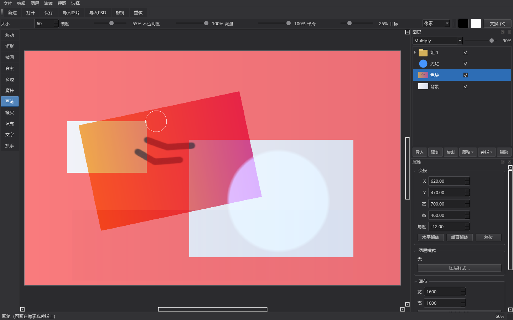

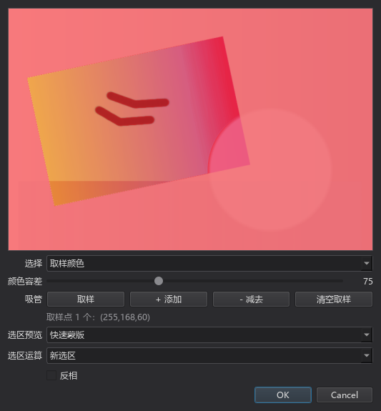

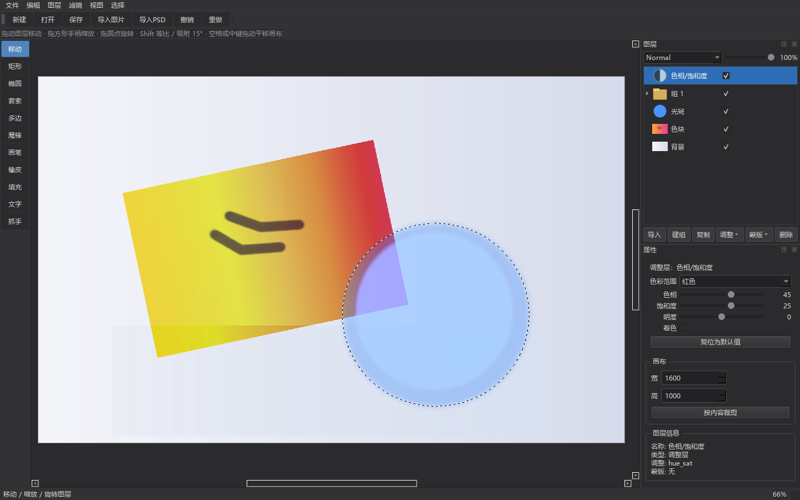

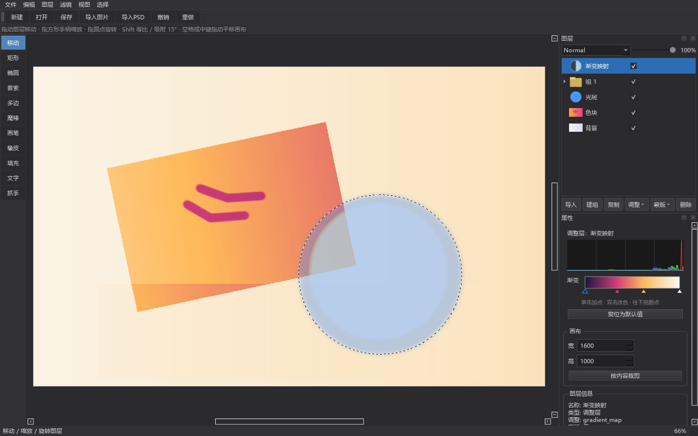

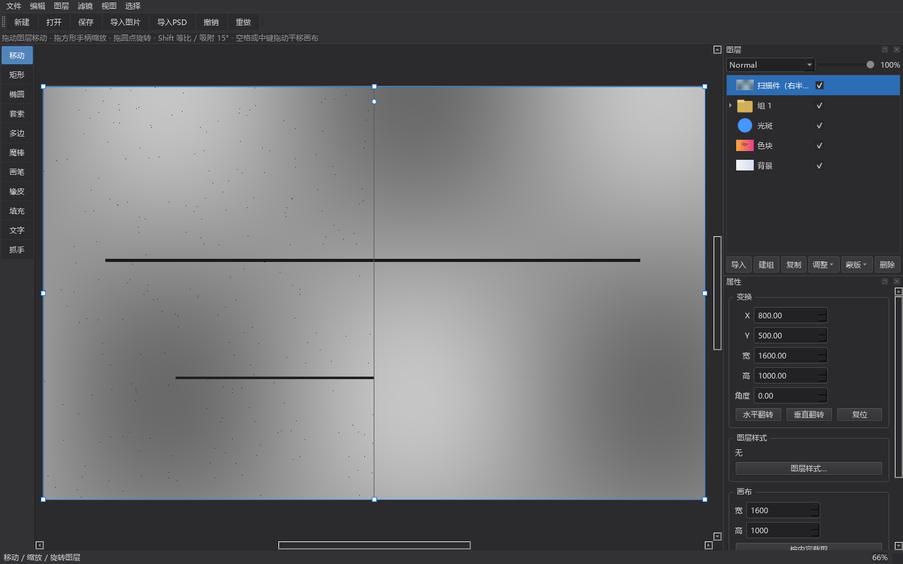

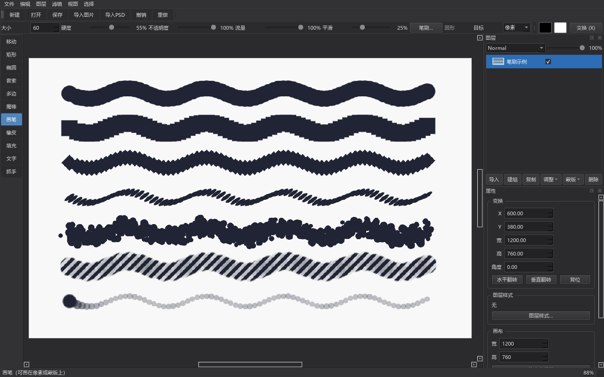

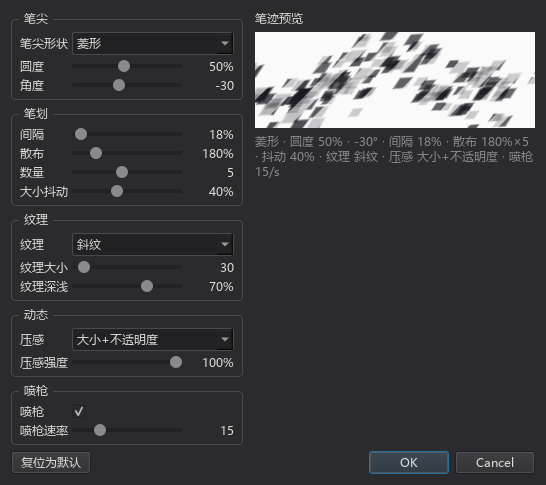

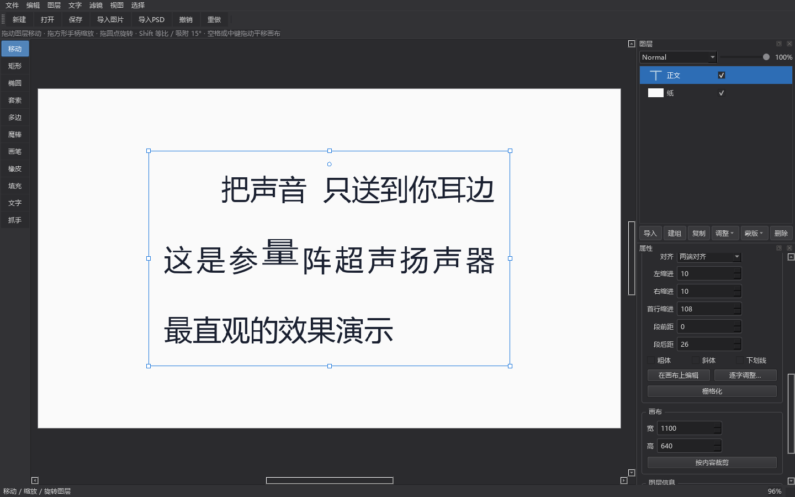

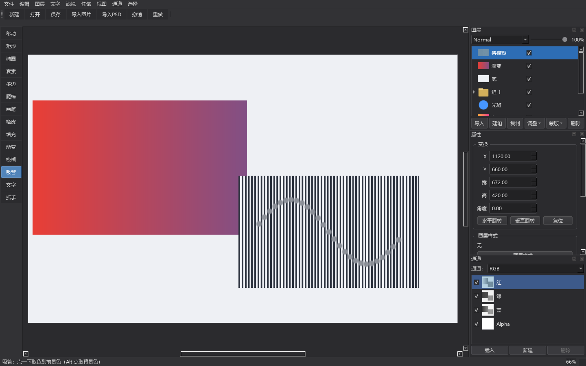

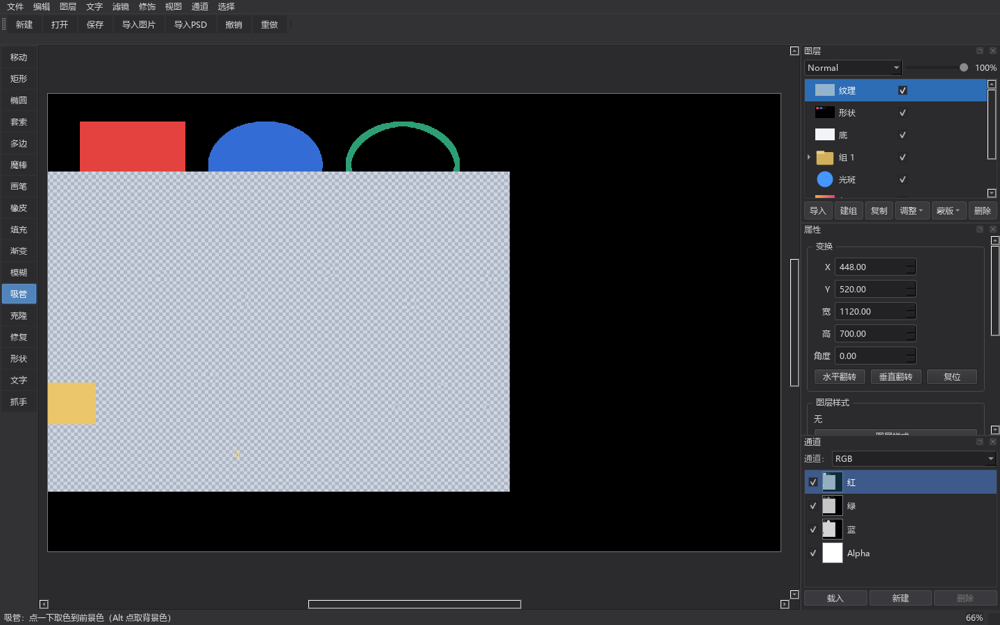

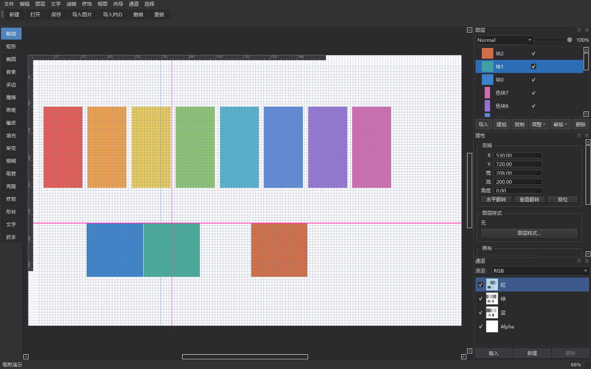

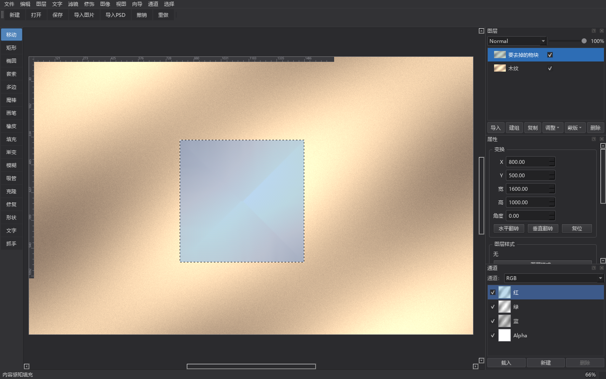

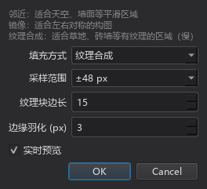

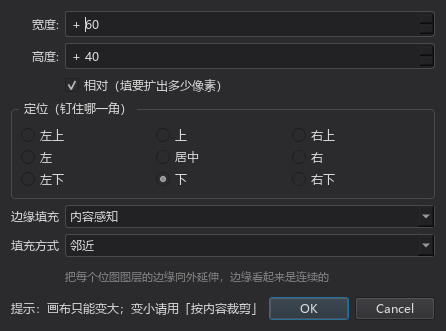

---

## 快速开始

需要 **Python 3.10+**（开发环境为 3.13），安装时记得勾选 *Add python.exe to PATH*。

```bat
run.bat
```

第一次运行会自动创建 `.venv` 虚拟环境并安装依赖（约几分钟，PySide6 比较大）。

也可以手动：

```bat
python -m venv .venv
.venv\Scripts\pip install -r requirements.txt
.venv\Scripts\python -m src.main
```

> 国内网络下装 PySide6 可能较慢，可换镜像源：
> `.venv\Scripts\pip install -r requirements.txt -i https://mirrors.aliyun.com/pypi/simple`

## 当前功能

**图层**
- 图层与图层组（文件夹），可多层嵌套
- 不透明度、Photoshop 面板顺序的**全部 27 种混合模式**（含色相/饱和度/颜色/明度）
- 图层组默认 Pass Through（子图层直接与下方背景混合），改混合模式或不透明度时自动隔离
- 图层蒙版：白色/黑色/从透明度/从明度/**从选区**建立，可反相、停用、删除、直接用画笔涂
- 复制、重命名（双击）、拖动排序、拖入/拖出图层组、置于顶层/底层
- 缩略图与可见性开关

**选区**
- 矩形、椭圆、自由套索、多边形套索、魔棒（按颜色，可 Ctrl 点击切换为全图不连续）
- 四种组合方式：新选区 / 添加到 / 从减去 / 与交叉（也可按住 Shift / Alt 临时切换）
- 羽化、扩展、收缩、**平滑**、**边界**、反选、全选、取消选择
- **色彩范围**：按取样颜色或预设范围挑出一片区域 —— 取 6 个色相 + 高光 / 中间调 /
  阴影 / 肤色，容差滑块决定边缘软硬，可以直接在预览图上用吸管点色（Shift 加 / Alt 减）
- **快速蒙版**（`Q`）：把选区变成一张能用画笔直接涂的灰度遮罩，涂黑排除、涂白纳入、
  涂灰半选中；红色可以盖在"未选中"或"选中"那一侧
- 在选区内部拖动可以移动选区轮廓
- **浮动选区也能缩放 / 旋转**：揭出来的那块内容可以先拖手柄调整（`Alt` 以中心、
  `Shift` 等比）再按 `Enter` 落定
- 行进蚁线显示（黑白双虚线，任何底色上都看得清），选区带半透明蓝罩
- **选区会限制**画笔、橡皮、填充、清除的作用范围，也会跟着图层缩放/旋转一起换算
- **内容感知填充**（`Shift+Ctrl+F`）：不填颜色，**填内容** —— 挖掉一块电线杆，
  填回来的是它背后的天空/墙面纹理。三种取样方式：
  **邻近**（以选区边缘为条件往里扩散，适合天空墙面）、**镜像**
  （关于选区中心对称翻，适合对称构图）、**纹理合成**（按块找最相似邻块贴进去，
  适合草地砖墙，慢一个量级）。对话框带**实时预览**，取消则整块还原

**绘制**
- 画笔：大小、硬度、不透明度、流量、平滑；软硬边过渡用 smoothstep
- **笔尖形状**：圆 / 方 / 菱三种，另有**圆度**（把笔尖压成椭圆）与**角度**（笔尖自转）
- **间隔**按**笔尖直径**的百分比算（Photoshop 语义，默认 25%），可以一路拉到 500% 画出点线
- **散布**：每个笔尖随机甩开一段距离（0~1000%），配合**数量**一次落多个，
  再加**大小抖动**就是一把"毛刷"
- **纹理**：无 + 点阵 / 网格 / 斜纹 / 棋盘 / 噪声（复用图层样式那套内置图案），
  可调大小与深浅；图案**锚在图像坐标上**，一笔划过去不会随笔尖游动
- **喷枪**：按住不动会按设定速率持续补笔、逐渐加深 —— 此时不透明度不再是单次描边的上限
- **速度压感**：鼠标没有笔压，用**运笔速度**模拟 —— 可选只缩大小 / 只降不透明度 / 两者都上，
  快笔自然变细变淡
- 进阶参数都在**「笔刷…」对话框**里（工具选项条上一行摘要随时看得到），
  对话框右侧是**所见即所得的笔迹预览**：真的用一支笔在白纸上走一条正弦曲线
- 橡皮擦：擦成透明（只削 alpha，保留颜色）
- 油漆桶 / 填充：用前景色或背景色
- 绘制目标可以切到**图层蒙版**（用前景色的灰度值涂，黑=隐藏、白=显示）
- 光圈跟随鼠标显示笔刷大小
- 不透明度按 Photoshop 语义实现：流量是每笔的量，不透明度是**单次描边**的累计上限

**修饰类工具**
- **渐变工具**（`Shift+G`）：在画布上拖出一条线，从前景色渐变到背景色。
  五种样式：线性 / 径向 / 角度 / 对称 / 菱形，工具选项条上可切
- **局部模糊**（`Shift+B`）：按住拖动，**只有笔刷盖住的那一块**被高斯模糊，
  边缘按笔刷形状羽化。多次涂抹会累积到完全模糊 —— 和 Photoshop 的模糊工具一样，
  不是给整层套一次滤镜。大图层上也是增量计算，按住拖动不卡
- **吸管**（`Shift+I`）：点一下取色到前景色。取样半径可设成邻域均值（避开杂点），
  可选从合成结果取还是只从当前图层取；快速蒙版模式下取的是遮罩灰度
- **克隆图章**（`Shift+C`）：按住 `Alt` 点一下采样，松开左键拖动盖章。
  采样之后源图层再改也不影响已采的那份 —— 同一张图上克隆不会「越涂越花」。
  图案跟着笔尖一起走，源区域在画布外时只画能画的那部分
- **污点修复**（`Shift+H`）：点过或拖过瑕点，用**周围像素推断**补上。
  浅瑕点直接换成旁边的颜色，深的（划痕、破洞）按边界扩散纹理，
  **纹理不会被抹平** —— 这是它和模糊工具的区别
- **形状工具**（`Shift+U`）：矩形 / 椭圆 / 直线，可切实心或描边，`Shift` 等比。
  画在画布上，**画完就是位图**，不像 Photoshop 的形状图层能保留锚点再编辑

**对齐向导**
- **标尺**（`Ctrl+Shift+R`）：画布左上两条，刻度密度随缩放自动换档
- **参考线**：从标尺拖出来，拖动可移动，`Alt` + 点击删除。
  垂直参考线会显示在顶部标尺上，水平参考线显示在左侧
- **布局网格**（`Ctrl+Shift+'`）：可设间距与每格等分数，只影响显示不影响像素。
  网格间距以**画布像素**计，缩放时不会跟着变（和 Photoshop 一致）
- **Snap To**：移动图层与变换时自动吸附到**参考线 > 网格 > 图层边缘与中心 >
  文档边界**（四级优先级，顺序可在「向导」菜单里逐项关掉）。
  命中的线会亮成洋红色；按住 `Ctrl` 临时关闭吸附
- 参考线与网格设置都**存进 `.cwproj`**，重开工程还在

**调整层（非破坏性，随时可改回去）**

15 种：**色阶**（含通道、输入/输出黑白场、中间调）、**曲线**（RGB 与单通道，可拖控制点）、
**曝光度**、**自然饱和度**、**色相/饱和度**（含着色，可按**色彩范围**只调某个色相带）、
**黑白**（六色相滑块 + 13 个常用**预设**）、
**色彩平衡**（阴影/中间调/高光 + 保留明度）、**亮度/对比度**、**通道混合器**（三组输出通道
加权 + 常数，可单色）、**渐变映射**（**任意控制点**的渐变，按亮度映射）、**照片滤镜**（任意滤镜色 +
浓度 + 保留明度）、**可选颜色**（9 个色彩族各调青/洋红/黄/黑，相对量）、
**反相**、**色调分离**、**阈值**。

- 调整层作用于**它下面所有图层的合成结果**，所以顺序、不透明度、蒙版、混合模式都照常生效
- 参数改动不碰像素，撤销栈里只存参数（拖滑块会合并成一个撤销点，不会把历史冲爆）
- 属性面板按参数表**自动生成控件**，色阶/曲线/曝光带实时直方图
- 曲线用**单调三次插值**（Fritsch–Carlson），拖点不会像 Catmull-Rom 那样过冲
- 色相/饱和度的「色彩范围」只推移落在该色相带里的像素（带内全效，向外 30° 线性过渡），
  中性灰不会被误伤；选「全图」就是原来的行为
- 黑白预设一键写进六个色相滑块；手动拖任何一条滑块会自动回到「自定义」
- 渐变映射的渐变条可以拖控制点改位置、空白处单击加一个、双击改颜色、往下拖出控件删掉；
  旧工程里存的「暗部/中间/亮部」三个颜色照样读得出来
- **剪贴蒙版**（`Ctrl+Alt+G`）：把基底图层渲进独立缓冲、套完调整再合成下去，
  所以调整只影响紧邻的基底那一层，对其他图层和背景完全没有副作用
- 调整层也能有自己的**蒙版**（画布尺寸），可以用画笔涂、从选区建立

**图层样式（非破坏性，参数存在图层上）**

10 种效果：**投影、外发光、内阴影、内发光、斜面浮雕、光泽、颜色叠加、渐变叠加、
图案叠加、描边**，在「图层样式…」对话框里实时预览。

- **全局光**：一处设好角度与高度，勾了「使用全局光」的投影 / 内阴影 / 斜面浮雕
  都跟着它一起变，不用逐个调
- 斜面浮雕可选内斜面 / 外斜面 / 浮雕 / 枕状浮雕四种样式、上下方向、深度与柔化
**通道面板**（`F2` 或「视图 → 通道面板」）

- **R / G / B / Alpha 四路**，勾选框直接切显示；关掉的 RGB 通道**显示为纸白**
  （和 Photoshop 一致，不是把该分量乘 0）
- **附加的 Alpha 通道**：从选区新建、双击改名、上移 / 下移、删除，最多 16 个
- 通道内容可**载入选区**（画布上立刻能接着画）；「并入合并的 Alpha」支持
  替换 / 添加 / 减去三种合并方式
- 通道遮罩**存进工程文件**，换台机器打开还在
- 通道只影响**显示与选区，不动图层数据** —— 关掉一个通道再画笔，画出来的东西
  和 Photoshop 一样；导出 PNG / JPEG 走的也是未经通道处理的画面

- 渐变叠加有线性 / 径向 / 角度 / 对称 / 菱形五种样式，双色渐变；图案叠加内置
  点阵 / 网格 / 斜纹 / 棋盘 / 噪声五种图案，可调缩放与混合模式
- 效果尺寸按**画布像素**算，不随图层变换缩放（和 Photoshop 一致）
- 描边会真的增加图层的 alpha，投影/发光在图层下方合成；内阴影、内发光、斜面、
  光泽与三种叠加只改颜色，形状与 alpha 纹丝不动
- 叠加类效果锚在**图层自己的内容框**上，所以局部重渲染、大画布分块渲染出来的
  渐变位置与整幅渲染完全一致
- 样式可以**复制 / 粘贴**（`Ctrl+Alt+C` / `Ctrl+Alt+V`），也能「存为默认值」——
  之后新建的样式都从这份参数出发
- 取消对话框会把参数整份还原；全部关掉时参数清空，保持工程文件干净

**智能对象（内容嵌入，可多实例共享）**
- 「图层 → 智能对象 → 转换为智能对象」（`Ctrl+Alt+S`）：图层/组连同它的剪贴蒙版
  调整层一起搬进一段可独立编辑的内容，外层只留一个壳
- 「编辑内容…」在独立窗口里改（工具、图层面板都是同一套），所有实例一起更新；
  「新建实例」复制图层但共用同一份内容，各自的变换 / 蒙版 / 智能滤镜互不影响
- **智能滤镜**：滤镜参数存在图层上，每次渲染重新施加 —— 随时改参数、调顺序、关掉、删掉
- 「栅格化智能对象」把内容与智能滤镜烧成普通像素，画面不变

**滤镜（破坏性，可撤销，受选区限制）**

11 种：高斯模糊、动感模糊、径向模糊、USM 锐化、中间值、**蒙尘与划痕**、添加杂色、
浮雕、查找边缘、高反差保留、最小值/最大值。

- 对话框里带**实时预览**，另有"强度"滑块（相当于 Photoshop 的渐隐）；取消则整块还原
- **中间值的半径可以到 100**（Photoshop 的上限也是 100）：半径大于 2 时会自动走
  8-bit 量化路径 —— OpenCV 的 `medianBlur` 对 float32 只支持 3×3 / 5×5，
  对 8-bit 却支持任意奇数核，而且**核越大几乎不变慢**（12 MP 上半径 3 和半径 100
  都是 ~0.2 秒），所以大半径成了实际上可用的功能
- **蒙尘与划痕**就是"只替换偏离中间值超过阈值的像素"：阈值 0 等价于纯中间值，
  阈值调到 255 则什么都不改。半径给得很大也能去掉长划痕、大块灰尘，
  而**没超阈值的纹理与细节原封不动** —— 这正是它比纯中间值好用的地方
- 模糊类滤镜**先预乘 alpha 再卷积**，所以透明区域旁边的像素不会被拖出脏黑边
- 在图层**源坐标系**上执行（半径单位是图层原始像素），和 Photoshop 一致
- 有选区时只在选区内生效，羽化边缘照样跟着走

**文字（非破坏性，参数随时可改）**
- 工具箱 `T`，在画布上点一下就建一个文字图层；工具选项条上有字体 / 字号 / 粗体 / 颜色
- 内容、字体、字号、颜色、行距、字距、对齐、粗体、斜体、下划线都在属性面板里改
- **`Ctrl+T` 在画布上直接编辑**：文字层上叠一个输入框，字号与行距跟着图层走，边打边看
- **段落属性**：左缩进 / 右缩进 / 首行缩进 / 段前距 / 段后距（像素）与**两端对齐**
- **逐字调整**：点一个字单独设它的字距 / 基线偏移 / 横向缩放（「逐字调整…」对话框）
- 文字由参数用 QPainter 栅格化，**改参数就重新生成**，不会因为缩放变糊
- 享受普通图层的一切：变换、蒙版、27 种混合模式、不透明度、剪贴蒙版
- 想用画笔 / 滤镜直接改像素时先「栅格化」转成普通位图图层（跟 Photoshop 一样）

**变换（非破坏性）**
- 移动、缩放、旋转、水平/垂直翻转
- 8 个缩放手柄 + 旋转手柄，Shift 等比 / 15° 吸附
- 属性面板可输入精确的 X / Y / 宽 / 高 / 角度
- 位图始终保存原始分辨率，缩放再放大不丢细节

**画布与文件**
- 新建工程、打开 / 保存 `.cwproj` 工程文件（zip 包，非破坏性）
- 导入 PNG / JPEG / BMP / WebP / TIFF / **HEIC**（手机照片）/ **SVG**（矢量） 作为图层
- **SVG 导入**（第二十三批）：自研子集解析器（`core/svg_import.py`），path / 基本形状 / `use` / 渐变 / 裁剪 / 变换 / 文字都出图，尺寸按画布走；`pattern` / `mask` / `filter` 这类语法不还原
- **导入 PSD**：整棵图层树搬进来，组 / 混合模式 / 不透明度 / 蒙版 / 剪贴 / 可见性都保留；
  **文字层会还原成可编辑文字**（字体 / 字号 / 粗斜 / 下划线 / 颜色 / 字距 / 行距 /
  对齐 / 缩进 / 段距都带过来，导入后还能改字、换字体），**图层样式也接得上**
  （10 种效果 + 全局光）。智能对象与调整层仍降级为合并位图；
  文字层在「字体不在系统里 / 同层混排 / 带描边 / 变形文字」时也会降级位图（画面优先）
- 导出为 PNG / JPEG
- **画布大小**（`Ctrl+Alt+C`）：九宫格锚点定位（钉住哪一角）+ **相对**模式
  （直接填要扩出多少像素）。新加出来的边有五种填法：内容感知 / 前景色 /
  白色 / 黑色 / 透明。**内容感知**会把每个位图图层的边缘向外延伸，
  边缘看起来是连续的，而不是突然多一圈
- **按内容裁剪**画布
- 缩放、平移（空格拖动或中键拖动）、适应窗口、实际像素
- 撤销 / 重做（40 步）

## 操作方式

左侧竖条是工具箱，切换工具后顶部那一行会变成对应的参数。

| 操作 | 方法 |
| --- | --- |
| 选择图层 | 图层面板点击，或在画布上点击图层内容（移动工具下） |
| 新建调整层 | 「图层 → 新建调整图层」，或图层面板底部的「调整」按钮；插入在当前图层上方 |
| 建文字图层 | 文字工具 `T` → 在画布上点一下；之后在属性面板里改字 / 字体 / 字号 |
| 改文字 | 选中文字图层，右侧属性面板「文字」区直接改；想用画笔 / 滤镜先点「栅格化」 |
| 在画布上改字 | 选中文字图层按 `Ctrl+T`，直接在画布上打字，`Esc` 结束 |
| 段落缩进 / 段落间距 | 属性面板「文字」区的左缩进 / 右缩进 / 首行缩进 / 段前距 / 段后距 |
| 单个字加宽 / 抬基线 | 属性面板「逐字调整…」→ 点一个字 → 拖字距 / 基线 / 水平缩放（画布上实时可见） |
| 导入 PSD | 「文件 → 导入 PSD」或 `Ctrl+Shift+O`，图层树整体进来；状态栏会告诉你几个文字层还原成了可编辑文字、几个降级成了位图 |
| 新建 Alpha 通道 | 「通道 → 新建通道…」或 `Ctrl+Alt+N`，把当前选区存成一个通道 |
| 通道载入选区 | 通道面板选中那一行 → 底部「载入」（或双击） |
| 显示 / 隐藏通道面板 | `F2` 或「视图 → 通道面板」 |
| 改调整参数 | 选中调整层，在右侧属性面板拖滑块（色阶/曲线/曝光有实时直方图参考） |
| 只调某个色相 | 色相/饱和度 → 「色彩范围」选红/黄/绿/青/蓝/洋红；选「全图」则是整体调整 |
| 用黑白预设 | 黑白 → 「预设」下拉框选一个（默认 / 较亮 / 六个彩色滤镜 / 红外线…），六个滑块会一起变 |
| 编辑渐变 | 渐变映射 → 渐变条上拖控制点 / 空白单击加点 / 双击改色 / 往下拖出控件删点 |
| 剪贴蒙版 | 选中调整层 → `Ctrl+Alt+G`（只作用于紧邻的下方图层） |
| 应用滤镜 | 「滤镜」菜单 → 选一种 → 调参数（有实时预览）→ 确定 |
| 去灰尘 / 划痕 | 「滤镜 → 蒙尘与划痕」：半径给大（4~10）、阈值 20~40；没超阈值的细节不会被糊掉 |
| 移动 / 缩放 / 旋转图层 | 移动工具：直接拖动 / 拖 8 个方形手柄（Shift 等比）/ 拖上方圆点（Shift 吸附 15°） |
| 建立选区 | 矩形、椭圆工具拖框；套索按住拖；多边形逐点点击、双击或点回起点闭合；魔棒单击 |
| 切换选区组合方式 | 工具选项条上的按钮，或按住 Shift（加）/ Alt（减）/ Shift+Alt（交） |
| 移动选区 | 用矩形/椭圆工具在选区**内部**拖动 |
| 修选区边 | 「选择」菜单 → 羽化… / 扩展… / 收缩… / **平滑…** / **边界…** |
| 按颜色挑区域 | 「选择 → 色彩范围…」：选预设或吸管点色，拖容差滑块实时预览，确定转为选区 |
| 画笔涂选区 | `Q` 进快速蒙版，画笔涂黑排除 / 涂白纳入，再按 `Q` 退出（在快速蒙版里 `Alt+Delete` 是"全部选中"） |
| 移动选中的像素 | 移动工具 + 有选区：在选区**内部**按住拖动（内容被揭成浮动层，原处挖空） |
| 落定 / 丢弃浮动内容 | `Enter` 落定（盖回图层）；`Esc` 丢弃（Ctrl+Z 可撤销）；换工具或换图层也会自动落定 |
| 复制选中的像素 | 移动工具 + 有选区，按住 `Alt` 拖动（原处保留） |
| 图层样式 | 「图层 → 图层样式…」或属性面板「图层样式…」按钮；10 种效果，带全局光 |
| 复制 / 粘贴样式 | `Ctrl+Alt+C` 复制选中图层的整套样式，`Ctrl+Alt+V` 贴到另一个图层 |
| 样式存为默认值 | 「图层 → 图层样式 → 存为默认值」，之后新建的样式都从它出发（可复位） |
| 取消进行中的套索 | Esc |
| 绘制 | 画笔/橡皮工具，按住左键涂抹 |
| 画渐变 | 渐变工具 `Shift+G`，在画布上拖一条线（前景色 → 背景色） |
| 局部模糊 | 模糊工具 `Shift+B`，按住拖动 |
| 吸管取色 | 吸管工具 `Shift+I`，点一下 |
| 克隆图章 | 克隆工具 `Shift+C`，**按住 Alt 点一下**采样，松开左键拖动盖章 |
| 污点修复 | 修复工具 `Shift+H`，点过瑕点 |
| 画形状 | 形状工具 `Shift+U`，拖出矩形 / 椭圆 / 直线（Shift 等比） |
| 加参考线 | 从左上标尺拖到画布上；拖动已有参考线可移动，`Alt` + 点击删除 |
| 内容感知填充 | 做好选区后「选择 → 内容感知填充…」（`Shift+Ctrl+F`），在对话框里换取样方式看实时预览 |
| 改画布大小 | 「图像 → 画布大小…」（`Ctrl+Alt+C`），九宫格里钉住一角，勾「相对」直接填扩出多少像素 |
| 临时关吸附 | 拖动时按住 `Ctrl` |
| 改笔刷形态 | 画笔工具 → 顶部「笔刷…」按钮：笔尖形状 / 圆度 / 角度 / 间隔 / 散布 / 抖动 / 纹理 / 喷枪 / 压感 |
| 平移画布 | 按住空格拖动，或中键拖动 |
| 缩放视图 | Ctrl + 滚轮 |
| 重命名 | 双击图层名 |
| 调整顺序 | 在图层面板里拖动 |

## 快捷键

**工具**：`V` 移动 · `M` 矩形 · `Shift+M` 椭圆 · `L` 套索 · `Shift+L` 多边形 ·
`W` 魔棒 · `B` 画笔 · `E` 橡皮 · `G` 填充 · `Shift+G` 渐变 · `Shift+B` 模糊 ·
`Shift+I` 吸管 · `Shift+C` 克隆 · `Shift+H` 修复 · `Shift+U` 形状 ·
`T` 文字 · `H` 抓手

**向导**：`Ctrl+Shift+R` 标尺 · `Ctrl+Shift+'` 网格

**图像**：`Ctrl+Alt+C` 画布大小

**命令**：`Ctrl+N` 新建 · `Ctrl+O` 打开 · `Ctrl+S` 保存 · `Ctrl+Shift+S` 另存为 ·
`Ctrl+I` 导入图片（PNG / JPEG / BMP / WebP / TIFF / HEIC / SVG） · `Ctrl+Shift+O` 导入 PSD · `Ctrl+Shift+E` 导出 PNG ·
`Ctrl+Z` 撤销 · `Ctrl+Shift+Z` 重做 · `Ctrl+G` 建组 · `Ctrl+J` 复制图层 ·
`Ctrl+Alt+G` 剪贴蒙版 · `Ctrl+Alt+C` / `Ctrl+Alt+V` 复制 / 粘贴图层样式 ·
`Ctrl+0` 适应窗口 · `Ctrl+1` 实际像素 · `F2` 通道面板 · `Ctrl+Alt+N` 新建通道

**选区**：`Ctrl+A` 全选 · `Ctrl+D` 取消选择 · `Ctrl+Shift+I` 反选 ·
`Alt+Delete` 用前景色填充 · `Ctrl+Delete` 用背景色填充 ·
`Delete` 清除选区内容（没有选区时删除图层） · `Shift+Ctrl+F` 内容感知填充 ·
`Q` 快速蒙版（再按一次转回选区） ·
`Enter` 落定浮动内容 · `Esc` 丢弃浮动内容

## 目录结构

```
src/
  core/
    blend.py       混合模式 + 合成（W3C 规范；含「下方不透明」快路径）
    layer.py       图层模型 + 变换矩阵
    document.py    工程（画布 + 图层树 + 选区）
    render.py      渲染器：仿射变换、蒙版、分组、合成、变换快路径、组内快照
    selection.py   选区：几何构造、并交差、羽化、扩缩、平滑、边界、轮廓
    float_sel.py   浮动选区（揭出选中的像素、落定、丢弃，可带缩放/旋转）
    quick_mask.py  快速蒙版：选区 <-> 可涂的灰度遮罩
    color_range.py 色彩范围：取样颜色 / 色相 / 明暗 → 匹配度遮罩
    retouch.py     修饰类工具：渐变 5 样式 / 局部模糊 / 吸管 / 克隆图章 / 污点修复
    guides.py      参考线 / 网格 / 标尺刻度 / 吸附判定
    content_aware.py 内容感知填充：邻近 / 镜像 / 纹理合成 + 扩展画布外的空白
    brush.py       笔刷图章（形状 / 纹理）+ 像素合成原语
    paint.py       描边引擎：逆变换、插值、平滑、散布 / 抖动 / 喷枪 / 压感
    adjust.py      15 种调整层的纯函数 + 参数描述表
    effects.py     图层样式（10 种效果 + 全局光）
    filters.py     11 种滤镜（预乘 alpha 的卷积、选区/强度混合、任意半径中间值）
    text.py        文字图层：QPainter 栅格化 + 逐字 / 段落参数（非破坏性）
    psd_import.py  PSD 导入：图层树映射、混合模式映射、降级链路调度
    psd_text.py    PSD 文字层（TySh）→ 可编辑文字层（单位换算 + 字体匹配 + 墨迹对齐）
    psd_effects.py PSD 图层样式（lfx2）→ effects（9 种效果 + 全局光）
    channels.py    通道模型：Alpha 通道 + RGB 显示开关 + 合并 Alpha
    history.py     撤销 / 重做
    svg_import.py  SVG 子集解析 + 栅格化（第二十三批）
    project_io.py  .cwproj 读写、图片导入导出
  ui/
    main_window.py 主窗口、工具、菜单与所有文档操作
    canvas_view.py 画布视图、变换手柄、选区交互、描边、蒙版红罩、画布内文字编辑
    layers_panel.py 图层面板
    channels_panel.py 通道面板
    inspector.py   属性面板
    adjust_panel.py 调整层参数面板（控件自动生成 + 曲线编辑器 + 渐变条 + 直方图）
    brush_dialog.py 笔刷设置对话框（笔尖 / 散布 / 纹理 / 喷枪 / 压感 + 笔迹预览）
    text_dialog.py 逐字调整对话框（点字调字距 / 基线 / 横向缩放）
    style_dialog.py 图层样式对话框（实时预览）
    filter_dialog.py 滤镜对话框（带实时预览）
    color_range_dialog.py 色彩范围对话框（吸管取样 + 5 种预览）
    content_aware_dialog.py 内容感知填充对话框（换取样方式 + 实时预览）
    canvas_size_dialog.py 画布大小对话框（九宫格锚点 + 相对模式 + 5 种填边）
    tool_options.py 顶部工具选项条
```

## 撤销是怎么做的

历史快照用**浅克隆**：图层对象新建，但 numpy 像素数组是与当前文档**共享**的。

所以任何会改像素的操作（画笔、橡皮、填充、清除）在动手之前都必须先调用
`Layer.detach_pixels()` 把要改的数组换成本层独占的副本 —— 这就是写时复制。
选区同理（`Document.detach_selection()`），通道遮罩也同理
（`Document.detach_channel()`）。好处是撤销栈几乎不占内存：
只有真正被改过的那一个图层会多一份拷贝，改结构（排序、显隐、混合模式）则完全不拷贝。

注意复制的是**整张位图**，不是脏矩形：改一个像素也要 copy 整层。实测
1600×1000 单层 6.1 MB，20 步撤销涨 122 MB（正好 20 × 6.1）。历史上限 40 步，
所以 12 MP 的单层（48 MB）最坏可能吃到 ~1.9 GB。日常尺寸（1600×1000 上下）
整份文档工作集一百多 MB，在正常范围。

`tools/selftest.py` 里有一条专门的测试盯着这件事：描边后撤销，像素必须逐位还原。

调整层不需要复制像素 —— 它没有任何位图，参数在 `clone()` 时深拷贝一份就够了，
所以「加一条曲线再改十次参数」在历史栈里只占几个字典。

## 工程文件格式

`.cwproj` 是一个 zip：

```
manifest.json       画布尺寸 + 全部图层参数（变换、混合模式、蒙版开关、
                    调整层类型与全部参数、文字图层的内容/字体/字号/颜色…）
layers/<id>.png     每个图层原始分辨率的 RGBA 位图
masks/<id>.png      每个图层的灰度蒙版
channels/<id>.png   每个附加 Alpha 通道的灰度遮罩（单通道）
```

位图永远按原始分辨率保存，变换和调整层 / 文字图层的参数都只存数值，
所以工程是非破坏性的。调整层没有位图，因此不会产生 PNG 条目；
文字图层存的是「参数 + 当前栅格化结果」，换台机器打开画面不变，参数也还在。
图层样式参数存在图层的 `effects` 字段里；浮动选区整个存下来（`float` 条目），
所以保存时浮着的内容也不会丢。

## 已知限制

- 图层样式没有等高线 / 纹理 / 图案自定义（叠加类用内置图案与双色渐变）
- **撤销栈的写时复制是按整层的**：改一个像素也要复制整张位图，不是只复制脏矩形。
  实测 1600×1000 单层 6.1 MB，20 步撤销涨 122 MB。历史上限 40 步，12 MP 单层最坏
  可能吃到 ~1.9 GB。想压可以调 `core/history.py` 里的步数上限，或给位图层加
  脏矩形级的 copy-on-write
- **右侧三个面板（图层 / 属性 / 通道）是上下叠放的**，窄栏里塞不下
  「变换 + 图层样式 + 通道」—— 属性面板会把「图层样式」和「通道」压得几乎看不见，
  通道列表只剩一条窄缝、底部三个按钮被压成扁条。Photoshop 是三栏并排
- 通道面板没有「通道集合」（Channel Set）：PS 能把一组通道存成集合一键切换，这里没有
- **附加通道不能直接用画笔涂**：通道遮罩只能从选区存入，或在代码里改；要手绘得先在画布上画出选区再存进通道
- 通道面板**不参与导出**：导出 PNG / JPEG 走的是未经通道处理的合成结果（与 PS 一致 —— 导出看的是作品，通道只是编辑辅助）
- 通道面板顶部的「通道种类」下拉是只读的：底层只有 RGB，灰度没有实现（面板上灰度只是显示上的近似）
- **PSD 文字层只在「整层一套样式」时还原**：`core.text` 的字体 / 字号 / 颜色是整层一套的，
  所以同一个文字层里混排（两段不同字号 / 不同颜色）只能降级成位图；带描边的文字、
  变形文字（warp）、沿路径排版同样降级。还原时不做 pt→px 的精确换算，而是量墨迹范围
  去对 PSD 的 bbox，所以**不同机器上字号可能有几像素出入，但位置和大小是对齐的**；
  PSD 的「固定行距」模式接不进来（统一按 1.2 行距处理）
- **PSD 的图案 / 自定义轮廓接不进来**：描边与图案叠加的位图、渐变的中间色标与抖动、
  自定义轮廓都取不到；渐变或图案填充的描边会退化成「取渐变首色当纯色」
- **内容感知的「纹理合成」对低频纹理无效**：块匹配的前提是块内像素真的有变化，
  一张明暗带周期上百像素的图（渐变墙面、大面积柔光），一个 15 px 的块里几乎是常量，
  匹配就退化了，填出来是一片平坦。这种情况请用**邻近**。
  另外它也不做多尺度金字塔，弱纹理上比 Photoshop 的结果差一截
- 画布大小**只能变大**（变小请用「按内容裁剪」）；逐层扩展时若图层被变换过（缩放 / 旋转），扩出来的边缘是按位图算的，不反算回变换
- 多边形套索的边是折线（无抗锯齿）；没有"扩大/收缩之外的选区交互式调整"工具
- **色彩范围是近似实现**：色相分界用 OpenCV 的 HSV、亮度用 Rec.601，
  Photoshop 走的是自己的色彩引擎 + CMYK 配置文件，数值会差几个百分点；
  也没有"本地化颜色簇"和"溢色"（需要 CMYK 配置文件）
- **快速蒙版不进工程文件**（它是编辑中的临时状态，Photoshop 也不存），
  撤销栈里有，误退出可以 `Ctrl+Z` 找回
- 色相/饱和度的**色彩范围**与「选择 → 色彩范围」共用同一套近似判定：色相分界用
  OpenCV 的 HSV、亮度用 Rec.601，Photoshop 走的是自己的色彩引擎 + CMYK 配置文件，
  数值会差几个百分点；也没有可调的过渡带宽度（固定 30°）
- 渐变的控制点只能分段线性插值，没有 Photoshop 的平滑 / 杂色抖动选项
- 黑白预设是常用系数组合的**近似还原**；六色相滑块用的也是自己的映射
  （保持黑白两端不动、只推中间调），数值不完全等于 Photoshop
- 可选颜色的 C/M/Y/K 是「相对量」算法，数值与 Photoshop 不严格一致
- 调整层的剪贴蒙版只支持「紧跟基底图层」这一种形式，不能多层嵌套成裁剪组
- 文字**没有自动换行 / 文本框**：只有硬换行，所以「两端对齐」是撑到最长那一行的宽度；
  段前 / 段后距只作用于段落之间（首段之前、末段之后不留）
- 逐字调整按**字符下标**记，所以在文字中间插字之后，后面的调整会整体错位（要重调）
- 逐字基线偏移是上下**对称**留白，给一个字抬基线会让整幅位图长高一点（换来的是
  文字块在画布上不跳、字形不被裁）

**性能**

- 12 MP 画布整幅重算约 **4.3 秒**（第十八批从 10.7 s 优化下来，-60%）。
  两条快路径：下方不透明时的合成公式化简、整数平移的图层不走插值
- 拖调整层滑块只重算它和它上面的图层：顶层与**组内**的调整层都支持
  （12 MP 约 1.2 s），不够快时还有代理渲染兜底
- 局部重渲染按**一组脏区**算而不是一个大矩形：一次拖拽在多处落笔时，
  只重算真正改动过的那几块
- `python -m tools.bench` 可以跑渲染基准（4 个场景，基线数字记在脚本文件头）
- 滤镜的**中间值 / 蒙尘与划痕**半径上限是 100（核 201）—— 这是 OpenCV 的安全边界，
  再往上会在小图上崩；半径 > 2 时走 8-bit 量化路径，精度损失最多 1/255
- 蒙尘与划痕是**近似实现**：按通道比较"原值 vs 中间值"，Photoshop 还会一起看窗口内的
  极值，阈值语义因此不完全一致（观感接近）；它也不碰 alpha，图案边缘的透明像素
  （RGB 通常是 0）会被一起算进中间值，细边缘上可能有一点点偏暗
- 大画布上渲染仍是 CPU 整幅 / 分块重算：交互期（拖手柄、涂抹）自动降到代理分辨率，
  松手或停手 350 ms 补齐全分辨率。12 MP 画布的整幅重算约 **4.3 秒**（第十八批从
  10.7 s 降下来）。剩下的空间在半透明叠加的通用路径与 Soft Light 这类
  非逐通道算子上，详见 HANDOFF §5.32
- 组内调整层的快照快路径**只支持一层**：调整层嵌在子组里时会退回整幅重算
- 画笔没有**数位板压感**：鼠标没有笔压，界面上的"压感"是用**运笔速度**模拟的
  （快笔变细 / 变淡），不是真的压力值；也没有 Photoshop 的"双重画笔""颜色动态"
- 散布 / 大小抖动 / 压感都是**按落笔事件**算的，没有数位板时速度值来自鼠标移动距离，
  快速甩笔时的抖动会比数位板明显一些
- 笔刷设置**不进工程文件**（它是工具参数，不是文档内容），关掉程序就恢复默认
- Dissolve 混合模式用的是固定噪声，视觉上接近但不完全等同 Photoshop
- 位图图层统一按 8-bit RGB 处理，不支持 CMYK / 16-bit / 32-bit

## 跑测试

```bat
.venv\Scripts\python -m tools.selftest    :: 核心层：混合模式/变换/选区/画笔/调整层/滤镜/撤销
.venv\Scripts\python -m tools.uitest      :: 界面冒烟（离屏，不弹窗）
.venv\Scripts\python -m tools.screenshot  :: 离屏生成界面截图
```

`tools/selftest.py` 里有几条专门盯调整层语义的测试：调整层不能影响它上方的图层、
不透明度 50% 反相要落在正确的中间值、黑蒙版要完全屏蔽、剪贴蒙版下背景必须原样保留、
曲线插值不能过冲、模糊在透明边界处不能产生黑边。

## 许可证

本项目采用 **MIT 许可证**，全文见 [LICENSE](LICENSE)。

```
Copyright (c) 2026 White-Looong
```

你可以自由使用、修改、分发本项目的代码（包括商业用途），只需保留原始的版权声明与许可声明。

### 第三方依赖

本项目依赖以下第三方库，它们的许可证与本项目的 MIT 许可证相互独立：

| 依赖 | 许可证 | 说明 |
| --- | --- | --- |
| [PySide6-Essentials](https://pypi.org/project/PySide6-Essentials/)（Qt for Python） | LGPL v3 | GUI 框架，以动态链接方式使用 |
| [numpy](https://numpy.org/) | BSD 3-Clause | 数值运算 |
| [opencv-python](https://pypi.org/project/opencv-python/) | Apache License 2.0 | 图像处理 |
| [Pillow](https://python-pillow.org/) | MIT-CMU | 图像编解码 |
| [psd-tools](https://pypi.org/project/psd-tools/)（可选） | MIT | PSD 导入 |
| [pillow-heif](https://pypi.org/project/pillow-heif/)（可选） | BSD-3 | HEIC / HEIF 导入（不装只是读不了手机照片） |

**关于 Qt / PySide6 的 LGPL v3**：本项目通过 `pip install PySide6-Essentials` 以**动态链接**
方式使用 Qt，未做静态链接、未修改 Qt 源码。因此你可以在 MIT 许可证下分发本项目自身的代码，
但分发时需一并满足 LGPL v3 的要求：

- 保留本节的依赖与许可证声明，随程序提供 LGPL v3 全文
  （<https://www.gnu.org/licenses/lgpl-3.0.html>）
- 不得阻碍最终用户替换 Qt 库本身（`pip` 安装方式天然满足这一点）
- 若将来把本项目打包为单一可执行文件分发，需另行确认 Qt 的可替换性要求

完整的第三方组件清单、版权信息与各许可证要点另见
[`NOTICE`](NOTICE) 文件（分发时请一并保留）。

友情提示：本项目是**完全独立实现**，没有使用、复制或改写
[robbietilton/Compositor](https://github.com/robbietilton/Compositor)
的任何源码（主项目用 Swift 写 macOS 应用，本项目用 Python 写 Windows 应用，两者无代码交集）。
仅借鉴其**产品理念与工作流布局**——功能设计思路本身不受版权保护（版权只保护表达，不保护思想）。

也正因如此，两个项目的许可证彼此独立、互不影响。本项目包含名为
`Compositor` 的 **Windows** 应用，与上游 macOS 项目同名但为不同作品，
双方均采用 MIT 许可证，不存在名称或商标冲突。

**关于兼容 Photoshop 的说明**：本项目在功能设计、面板布局、默认快捷键与算法语义上
有意向 Adobe Photoshop 看齐，以便用户迁移。这种兼容性设计属于业界通行的
「功能互操作性」实践，不构成对 Adobe 知识产权的使用——本项目：
不含 Adobe 的任何代码、资源、图标或字体；
不使用 Adobe 的商标作为自身标识（"Photoshop" 仅以**描述性/指代性**方式提及，
用于说明兼容对象，而非宣称与本项目存在关联或获其授权）。

