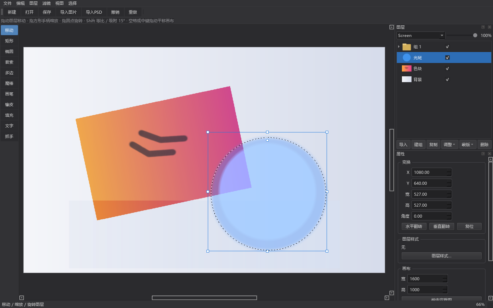
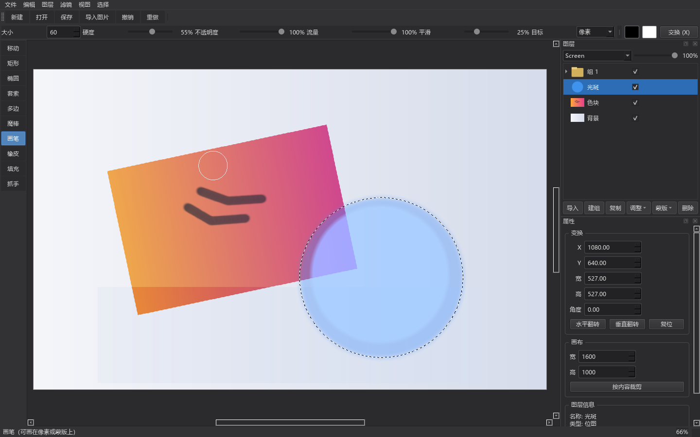
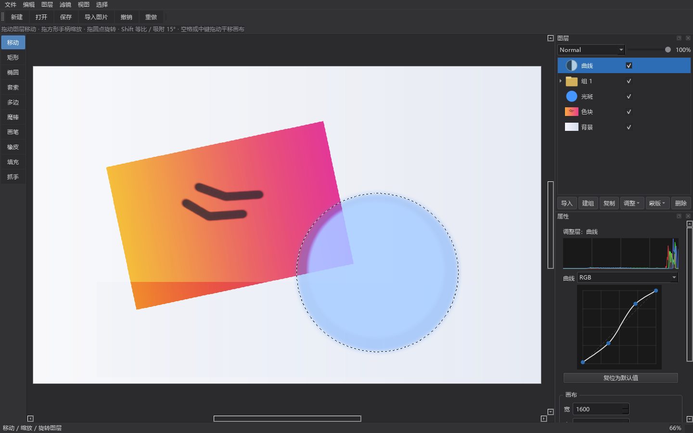
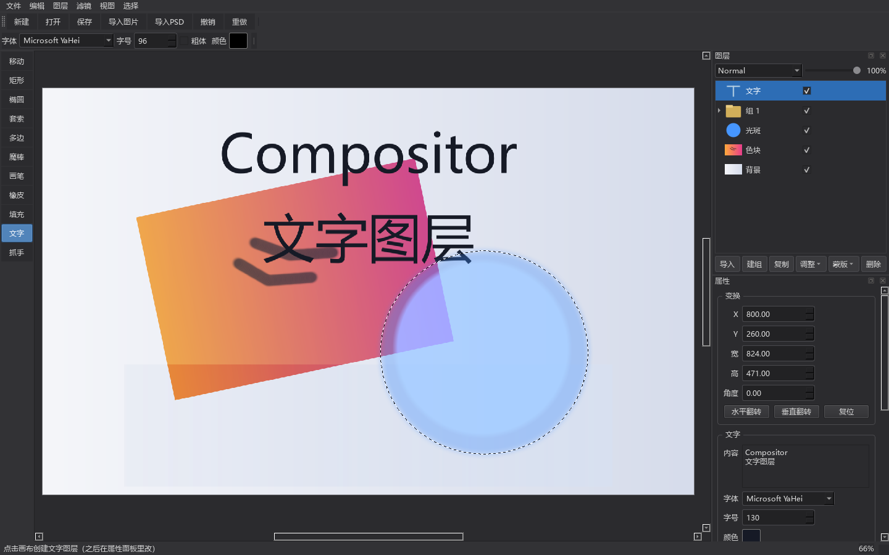
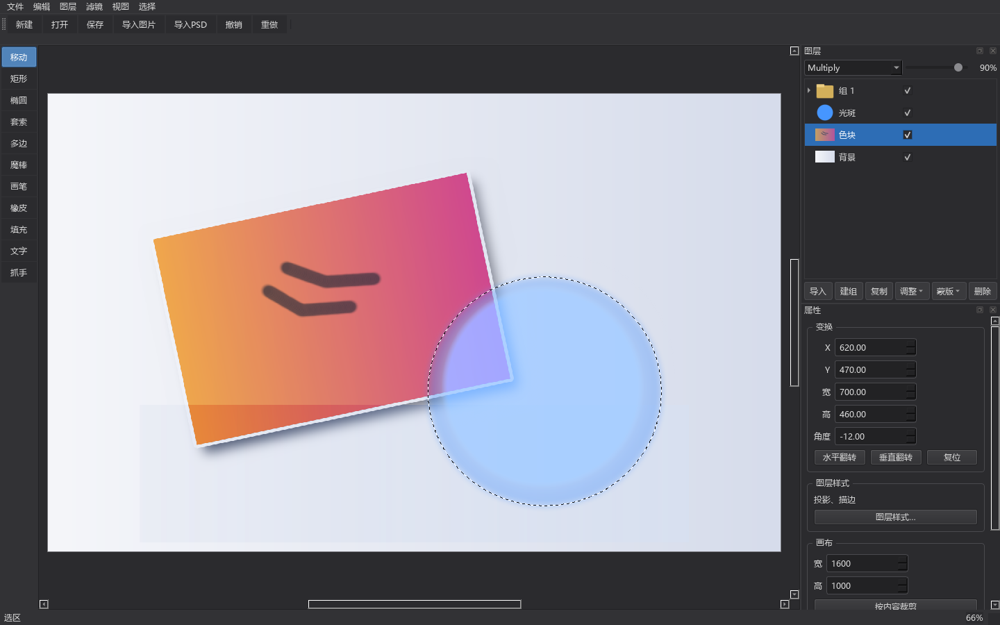

# Compositor for Windows

一个跑在 Windows 上的开源图层式图像编辑器，用 Python + PySide6 写成。

它的目标是替代 Photoshop 做**合成与后期**的核心工作流：图层、蒙版、混合模式、
非破坏性变换、调整层、滤镜、选区、画笔、文字与 PSD 导入。
受 [robbietilton/Compositor](https://github.com/robbietilton/Compositor)
启发——那个项目是 macOS 独占的（Swift / Xcode / macOS 26 + Apple silicon），
这里是给 Windows 的对应实现，**不是**它的移植版，功能范围也小得多。











---

## 快速开始

需要 **Python 3.10+**（开发环境为 3.13），安装时记得勾选 *Add python.exe to PATH*。

```bat
run.bat
```

第一次运行会自动创建 `.venv` 虚拟环境并安装依赖（约几分钟，PySide6 比较大）。

也可以手动：

```bat
python -m venv .venv
.venv\Scripts\pip install -r requirements.txt
.venv\Scripts\python -m src.main
```

> 国内网络下装 PySide6 可能较慢，可换镜像源：
> `.venv\Scripts\pip install -r requirements.txt -i https://mirrors.aliyun.com/pypi/simple`

## 当前功能

**图层**
- 图层与图层组（文件夹），可多层嵌套
- 不透明度、Photoshop 面板顺序的**全部 27 种混合模式**（含色相/饱和度/颜色/明度）
- 图层组默认 Pass Through（子图层直接与下方背景混合），改混合模式或不透明度时自动隔离
- 图层蒙版：白色/黑色/从透明度/从明度/**从选区**建立，可反相、停用、删除、直接用画笔涂
- 复制、重命名（双击）、拖动排序、拖入/拖出图层组、置于顶层/底层
- 缩略图与可见性开关

**选区**
- 矩形、椭圆、自由套索、多边形套索、魔棒（按颜色，可 Ctrl 点击切换为全图不连续）
- 四种组合方式：新选区 / 添加到 / 从减去 / 与交叉（也可按住 Shift / Alt 临时切换）
- 羽化、扩展、收缩、反选、全选、取消选择
- 在选区内部拖动可以移动选区轮廓
- 行进蚁线显示（黑白双虚线，任何底色上都看得清），选区带半透明蓝罩
- **选区会限制**画笔、橡皮、填充、清除的作用范围，也会跟着图层缩放/旋转一起换算

**绘制**
- 画笔：大小、硬度、不透明度、流量、平滑；软硬边过渡用 smoothstep
- 橡皮擦：擦成透明（只削 alpha，保留颜色）
- 油漆桶 / 填充：用前景色或背景色
- 绘制目标可以切到**图层蒙版**（用前景色的灰度值涂，黑=隐藏、白=显示）
- 光圈跟随鼠标显示笔刷大小
- 不透明度按 Photoshop 语义实现：流量是每笔的量，不透明度是**单次描边**的累计上限

**调整层（非破坏性，随时可改回去）**

15 种：**色阶**（含通道、输入/输出黑白场、中间调）、**曲线**（RGB 与单通道，可拖控制点）、
**曝光度**、**自然饱和度**、**色相/饱和度**（含着色）、**黑白**（六色相滑块）、
**色彩平衡**（阴影/中间调/高光 + 保留明度）、**亮度/对比度**、**通道混合器**（三组输出通道
加权 + 常数，可单色）、**渐变映射**（三段渐变，按亮度映射）、**照片滤镜**（任意滤镜色 +
浓度 + 保留明度）、**可选颜色**（9 个色彩族各调青/洋红/黄/黑，相对量）、
**反相**、**色调分离**、**阈值**。

- 调整层作用于**它下面所有图层的合成结果**，所以顺序、不透明度、蒙版、混合模式都照常生效
- 参数改动不碰像素，撤销栈里只存参数（拖滑块会合并成一个撤销点，不会把历史冲爆）
- 属性面板按参数表**自动生成控件**，色阶/曲线/曝光带实时直方图
- 曲线用**单调三次插值**（Fritsch–Carlson），拖点不会像 Catmull-Rom 那样过冲
- **剪贴蒙版**（`Ctrl+Alt+G`）：把基底图层渲进独立缓冲、套完调整再合成下去，
  所以调整只影响紧邻的基底那一层，对其他图层和背景完全没有副作用
- 调整层也能有自己的**蒙版**（画布尺寸），可以用画笔涂、从选区建立

**图层样式（非破坏性，参数存在图层上）**

**描边**（外部 / 内部 / 居中）、**投影**、**内阴影**、**外发光**四种，在属性面板的
「图层样式…」对话框里实时预览。

- 效果尺寸按**画布像素**算，不随图层变换缩放（和 Photoshop 一致）
- 描边会真的增加图层的 alpha，投影/发光在图层下方合成，内阴影只压暗内侧不改 alpha
- 取消对话框会把参数整份还原；全部关掉时参数清空，保持工程文件干净

**滤镜（破坏性，可撤销，受选区限制）**

10 种：高斯模糊、动感模糊、径向模糊、USM 锐化、中间值、添加杂色、浮雕、查找边缘、高反差保留、最小值/最大值。

- 对话框里带**实时预览**，另有"强度"滑块（相当于 Photoshop 的渐隐）；取消则整块还原
- 模糊类滤镜**先预乘 alpha 再卷积**，所以透明区域旁边的像素不会被拖出脏黑边
- 在图层**源坐标系**上执行（半径单位是图层原始像素），和 Photoshop 一致
- 有选区时只在选区内生效，羽化边缘照样跟着走

**文字（非破坏性，参数随时可改）**
- 工具箱 `T`，在画布上点一下就建一个文字图层；工具选项条上有字体 / 字号 / 粗体 / 颜色
- 内容、字体、字号、颜色、行距、字距、对齐、粗体、斜体、下划线都在属性面板里改
- 文字由参数用 QPainter 栅格化，**改参数就重新生成**，不会因为缩放变糊
- 享受普通图层的一切：变换、蒙版、27 种混合模式、不透明度、剪贴蒙版
- 想用画笔 / 滤镜直接改像素时先「栅格化」转成普通位图图层（跟 Photoshop 一样）

**变换（非破坏性）**
- 移动、缩放、旋转、水平/垂直翻转
- 8 个缩放手柄 + 旋转手柄，Shift 等比 / 15° 吸附
- 属性面板可输入精确的 X / Y / 宽 / 高 / 角度
- 位图始终保存原始分辨率，缩放再放大不丢细节

**画布与文件**
- 新建工程、打开 / 保存 `.cwproj` 工程文件（zip 包，非破坏性）
- 导入 PNG / JPEG / BMP / WebP / TIFF 作为图层
- **导入 PSD**：整棵图层树搬进来，组 / 混合模式 / 不透明度 / 蒙版 / 剪贴 / 可见性都保留
  （文字、智能对象、调整层降级为合并位图）
- 导出为 PNG / JPEG
- 按内容裁剪画布
- 缩放、平移（空格拖动或中键拖动）、适应窗口、实际像素
- 撤销 / 重做（40 步）

## 操作方式

左侧竖条是工具箱，切换工具后顶部那一行会变成对应的参数。

| 操作 | 方法 |
| --- | --- |
| 选择图层 | 图层面板点击，或在画布上点击图层内容（移动工具下） |
| 新建调整层 | 「图层 → 新建调整图层」，或图层面板底部的「调整」按钮；插入在当前图层上方 |
| 建文字图层 | 文字工具 `T` → 在画布上点一下；之后在属性面板里改字 / 字体 / 字号 |
| 改文字 | 选中文字图层，右侧属性面板「文字」区直接改；想用画笔 / 滤镜先点「栅格化」 |
| 导入 PSD | 「文件 → 导入 PSD」或 `Ctrl+Shift+O`，图层树整体进来 |
| 改调整参数 | 选中调整层，在右侧属性面板拖滑块（色阶/曲线/曝光有实时直方图参考） |
| 剪贴蒙版 | 选中调整层 → `Ctrl+Alt+G`（只作用于紧邻的下方图层） |
| 应用滤镜 | 「滤镜」菜单 → 选一种 → 调参数（有实时预览）→ 确定 |
| 移动 / 缩放 / 旋转图层 | 移动工具：直接拖动 / 拖 8 个方形手柄（Shift 等比）/ 拖上方圆点（Shift 吸附 15°） |
| 建立选区 | 矩形、椭圆工具拖框；套索按住拖；多边形逐点点击、双击或点回起点闭合；魔棒单击 |
| 切换选区组合方式 | 工具选项条上的按钮，或按住 Shift（加）/ Alt（减）/ Shift+Alt（交） |
| 移动选区 | 用矩形/椭圆工具在选区**内部**拖动 |
| 移动选中的像素 | 移动工具 + 有选区：在选区**内部**按住拖动（内容被揭成浮动层，原处挖空） |
| 落定 / 丢弃浮动内容 | `Enter` 落定（盖回图层）；`Esc` 丢弃（Ctrl+Z 可撤销）；换工具或换图层也会自动落定 |
| 复制选中的像素 | 移动工具 + 有选区，按住 `Alt` 拖动（原处保留） |
| 图层样式 | 「图层 → 图层样式…」或属性面板「图层样式…」按钮 |
| 取消进行中的套索 | Esc |
| 绘制 | 画笔/橡皮工具，按住左键涂抹 |
| 平移画布 | 按住空格拖动，或中键拖动 |
| 缩放视图 | Ctrl + 滚轮 |
| 重命名 | 双击图层名 |
| 调整顺序 | 在图层面板里拖动 |

## 快捷键

**工具**：`V` 移动 · `M` 矩形 · `Shift+M` 椭圆 · `L` 套索 · `Shift+L` 多边形 ·
`W` 魔棒 · `B` 画笔 · `E` 橡皮 · `G` 填充 · `T` 文字 · `H` 抓手

**命令**：`Ctrl+N` 新建 · `Ctrl+O` 打开 · `Ctrl+S` 保存 · `Ctrl+Shift+S` 另存为 ·
`Ctrl+I` 导入图片 · `Ctrl+Shift+O` 导入 PSD · `Ctrl+Shift+E` 导出 PNG ·
`Ctrl+Z` 撤销 · `Ctrl+Shift+Z` 重做 · `Ctrl+G` 建组 · `Ctrl+J` 复制图层 ·
`Ctrl+Alt+G` 剪贴蒙版 · `Ctrl+0` 适应窗口 · `Ctrl+1` 实际像素

**选区**：`Ctrl+A` 全选 · `Ctrl+D` 取消选择 · `Ctrl+Shift+I` 反选 ·
`Alt+Delete` 用前景色填充 · `Ctrl+Delete` 用背景色填充 ·
`Delete` 清除选区内容（没有选区时删除图层）

## 目录结构

```
src/
  core/
    blend.py       混合模式与合成（W3C Compositing and Blending Level 1）
    layer.py       图层模型 + 变换矩阵
    document.py    工程（画布 + 图层树 + 选区）
    render.py      渲染器：仿射变换、蒙版、分组、合成
    selection.py   选区：几何构造、并交差、羽化、扩缩、轮廓
    brush.py       笔刷图章与像素合成原语
    paint.py       描边引擎：逆变换、插值、平滑、流量/不透明度上限
    adjust.py      15 种调整层的纯函数 + 参数描述表
    effects.py     图层样式（描边/投影/内阴影/外发光）
    float_sel.py   浮动选区（揭出选中的像素、落定、丢弃）
    filters.py     10 种滤镜（预乘 alpha 的卷积、选区/强度混合）
    text.py        文字图层：QPainter 栅格化 + 参数表（非破坏性）
    psd_import.py  PSD 导入：图层树映射、混合模式映射、降级规则
    history.py     撤销 / 重做
    project_io.py  .cwproj 读写、图片导入导出
  ui/
    main_window.py 主窗口、工具、菜单与所有文档操作
    canvas_view.py 画布视图、变换手柄、选区交互、描边
    layers_panel.py 图层面板
    inspector.py   属性面板
    adjust_panel.py 调整层参数面板（控件自动生成 + 曲线编辑器 + 直方图）
    style_dialog.py 图层样式对话框（实时预览）
    filter_dialog.py 滤镜对话框（带实时预览）
    tool_options.py 顶部工具选项条
```

## 撤销是怎么做的

历史快照用**浅克隆**：图层对象新建，但 numpy 像素数组是与当前文档**共享**的。

所以任何会改像素的操作（画笔、橡皮、填充、清除）在动手之前都必须先调用
`Layer.detach_pixels()` 把要改的数组换成本层独占的副本 —— 这就是写时复制。
选区同理（`Document.detach_selection()`）。好处是撤销栈几乎不占内存：
只有真正被改过的那一个图层会多一份拷贝，改结构（排序、显隐、混合模式）则完全不拷贝。

`tools/selftest.py` 里有一条专门的测试盯着这件事：描边后撤销，像素必须逐位还原。

调整层不需要复制像素 —— 它没有任何位图，参数在 `clone()` 时深拷贝一份就够了，
所以「加一条曲线再改十次参数」在历史栈里只占几个字典。

## 工程文件格式

`.cwproj` 是一个 zip：

```
manifest.json       画布尺寸 + 全部图层参数（变换、混合模式、蒙版开关、
                    调整层类型与全部参数、文字图层的内容/字体/字号/颜色…）
layers/<id>.png     每个图层原始分辨率的 RGBA 位图
masks/<id>.png      每个图层的灰度蒙版
```

位图永远按原始分辨率保存，变换和调整层 / 文字图层的参数都只存数值，
所以工程是非破坏性的。调整层没有位图，因此不会产生 PNG 条目；
文字图层存的是「参数 + 当前栅格化结果」，换台机器打开画面不变，参数也还在。
图层样式参数存在图层的 `effects` 字段里；浮动选区整个存下来（`float` 条目），
所以保存时浮着的内容也不会丢。

## 已知限制

- **没有**智能对象、斜面浮雕/光泽/颜色叠加等其余图层样式
- 选区的"平滑/边界"没有做，多边形套索的边是折线（无抗锯齿）
- 色相/饱和度只做全图，没有分色彩范围
- 渐变映射只有三段（暗部/中间/亮部），没有任意控制点的渐变编辑器
- 可选颜色的 C/M/Y/K 是「相对量」算法，数值与 Photoshop 不严格一致
- 调整层的剪贴蒙版只支持「紧跟基底图层」这一种形式，不能多层嵌套成裁剪组
- 滤镜的**中间值**只用 OpenCV 的 3×3 / 5×5（半径 1~2），做不了大半径的"蒙尘与划痕"
- 滤镜对话框的预览是**每改一次参数就整层重算**，几千万像素的大图层上会有明显卡顿
- 大画布（>800 万像素）拖动变换、大笔刷涂抹或密集调参数时会掉帧；渲染是整幅重算，没有分块缓存
- 画笔只有圆形，没有笔尖形状、压感、纹理、散布
- Dissolve 混合模式用的是固定噪声，视觉上接近但不完全等同 Photoshop
- 黑白的六色相滑块用的是自己的映射（保持黑白两端不动、只推中间调），数值不完全等于 Photoshop
- 位图图层统一按 8-bit RGB 处理，不支持 CMYK / 16-bit / 32-bit

## 跑测试

```bat
.venv\Scripts\python -m tools.selftest    :: 核心层：混合模式/变换/选区/画笔/调整层/滤镜/撤销
.venv\Scripts\python -m tools.uitest      :: 界面冒烟（离屏，不弹窗）
.venv\Scripts\python -m tools.screenshot  :: 离屏生成界面截图
```

`tools/selftest.py` 里有几条专门盯调整层语义的测试：调整层不能影响它上方的图层、
不透明度 50% 反相要落在正确的中间值、黑蒙版要完全屏蔽、剪贴蒙版下背景必须原样保留、
曲线插值不能过冲、模糊在透明边界处不能产生黑边。

## 许可证

本项目采用 **MIT 许可证**，全文见 [LICENSE](LICENSE)。

```
Copyright (c) 2026 White-Looong
```

你可以自由使用、修改、分发本项目的代码（包括商业用途），只需保留原始的版权声明与许可声明。

### 第三方依赖

本项目依赖以下第三方库，它们的许可证与本项目的 MIT 许可证相互独立：

| 依赖 | 许可证 | 说明 |
| --- | --- | --- |
| [PySide6-Essentials](https://pypi.org/project/PySide6-Essentials/)（Qt for Python） | LGPL v3 | GUI 框架，以动态链接方式使用 |
| [numpy](https://numpy.org/) | BSD 3-Clause | 数值运算 |
| [opencv-python](https://pypi.org/project/opencv-python/) | Apache License 2.0 | 图像处理 |
| [Pillow](https://python-pillow.org/) | MIT-CMU | 图像编解码 |
| [psd-tools](https://pypi.org/project/psd-tools/)（可选） | MIT | PSD 导入 |

**关于 Qt / PySide6 的 LGPL v3**：本项目通过 `pip install PySide6-Essentials` 以**动态链接**
方式使用 Qt，未做静态链接、未修改 Qt 源码。因此你可以在 MIT 许可证下分发本项目自身的代码，
但分发时需一并满足 LGPL v3 的要求：

- 保留本节的依赖与许可证声明，随程序提供 LGPL v3 全文
  （<https://www.gnu.org/licenses/lgpl-3.0.html>）
- 不得阻碍最终用户替换 Qt 库本身（`pip` 安装方式天然满足这一点）
- 若将来把本项目打包为单一可执行文件分发，需另行确认 Qt 的可替换性要求

完整的第三方组件清单、版权信息与各许可证要点另见
[`NOTICE`](NOTICE) 文件（分发时请一并保留）。

友情提示：本项目是**完全独立实现**，没有使用、复制或改写
[robbietilton/Compositor](https://github.com/robbietilton/Compositor)
的任何源码（主项目用 Swift 写 macOS 应用，本项目用 Python 写 Windows 应用，两者无代码交集）。
仅借鉴其**产品理念与工作流布局**——功能设计思路本身不受版权保护（版权只保护表达，不保护思想）。

也正因如此，两个项目的许可证彼此独立、互不影响。本项目包含名为
`Compositor` 的 **Windows** 应用，与上游 macOS 项目同名但为不同作品，
双方均采用 MIT 许可证，不存在名称或商标冲突。

**关于兼容 Photoshop 的说明**：本项目在功能设计、面板布局、默认快捷键与算法语义上
有意向 Adobe Photoshop 看齐，以便用户迁移。这种兼容性设计属于业界通行的
「功能互操作性」实践，不构成对 Adobe 知识产权的使用——本项目：
不含 Adobe 的任何代码、资源、图标或字体；
不使用 Adobe 的商标作为自身标识（"Photoshop" 仅以**描述性/指代性**方式提及，
用于说明兼容对象，而非宣称与本项目存在关联或获其授权）。

